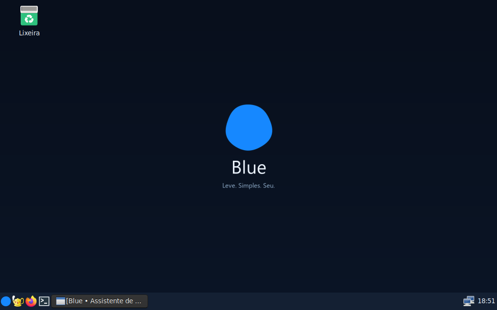

# Blue

**Linux leve para quem programa.**

Blue é uma distribuição baseada no Debian 13, criada e mantida por **Renvenge**. A proposta é oferecer uma área de trabalho simples, ferramentas de desenvolvimento prontas e liberdade para instalar o que cada projeto precisa.

O projeto é desenvolvido com auxílio de ferramentas de IA. Renvenge define a proposta e a direção do Blue; os componentes de terceiros mantêm seus autores e licenças.

**Versão atual: 0.3 — experimental, Live com persistência.** Ainda não há instalador de disco nem modelo de IA incluído.

## O que o Blue oferece

- Desktop LXDE/Openbox com uma barra inferior, tema escuro e círculo azul irregular como identidade visual.
- Geany, terminal, Git, GCC/G++, Python, Node.js/npm, CMake, GDB e SQLite.
- APT e Synaptic para instalar programas; ambientes virtuais Python e projetos npm continuam disponíveis.
- Persistência de arquivos, configurações e instalações quando há um disco `blue-data` preparado.
- Ajuste automático de resolução no VirtualBox com VMSVGA.
- Blue Assistant: monitor local de recursos e cliente para conversar com um modelo executado separadamente.
- Idioma e teclado brasileiros, fuso America/Fortaleza e memória comprimida com zram.

## Começar

1. Obtenha `Blue-0.3-amd64.iso` e seu arquivo `.sha256` na release correspondente, quando publicada.
2. Confira o checksum e crie uma VM Debian de 64 bits com duas CPUs, 2 GB de RAM e controlador VMSVGA.
3. Conecte a ISO ao leitor virtual e inicie a VM. O usuário `blue` entra automaticamente.
4. Para salvar mudanças, prepare um disco persistente conforme o [guia de uso em VM](docs/USO-EM-VM.md).

A ISO sem um disco de persistência funciona para experimentar o sistema, mas não conserva as alterações. Mantenha a ISO conectada mesmo quando usar persistência.

## Documentação

| Guia | Conteúdo |
| --- | --- |
| [Uso em VM](docs/USO-EM-VM.md) | Configuração, persistência, tela e solução de problemas |
| [Programação](docs/PROGRAMACAO.md) | Instalação de programas e primeiros projetos |
| [Compilação](docs/COMPILACAO.md) | Construção da ISO em Debian 13 |
| [Arquitetura](docs/ARQUITETURA.md) | Organização das fontes e inicialização |
| [Assistente](ASSISTENTE.md) | Monitor, modelo local e limitações da IA |
| [Privacidade](docs/PRIVACIDADE.md) | O que o assistente coleta e envia |
| [Validação](VALIDACAO.md) | Testes realizados e evidências |
| [Próximos passos](docs/ROADMAP.md) | Possibilidades de evolução |
| [Contribuições](CONTRIBUTING.md) | Como reportar problemas e propor mudanças |
| [Publicação](docs/PUBLICACAO.md) | Preparação do repositório e das releases |

## Estado da versão 0.3

Foram verificadas 20 operações de programação, a instalação de um programa pelo APT, a preservação de arquivo e programa após desligar e ligar a VM e o redimensionamento de tela. Há também dez testes unitários entre assistente e preparação de disco.

A versão 0.3 foi testada em UEFI no VirtualBox 7.0.8. Secure Boot e hardware físico ainda não foram validados. Duas CPUs e 2 GB de RAM são uma configuração inicial para desenvolvimento leve; navegador, projetos maiores e modelos de IA podem exigir mais recursos. Os testes não representam compatibilidade com todo programa existente.

## Autoria e licenças

**Criador e mantenedor: Renvenge.** Veja [AUTHORS.md](AUTHORS.md) para os créditos e [CHANGELOG.md](CHANGELOG.md) para o histórico.

As fontes e a arte originais do Blue usam a [licença MIT](LICENSE). Debian, Linux, LXDE, Openbox, VirtualBox e os demais componentes preservam suas próprias licenças. A licença MIT do projeto não substitui essas licenças; consulte [THIRD_PARTY_NOTICES.md](THIRD_PARTY_NOTICES.md).

Blue é um projeto independente, sem afiliação oficial com Debian ou Oracle.
